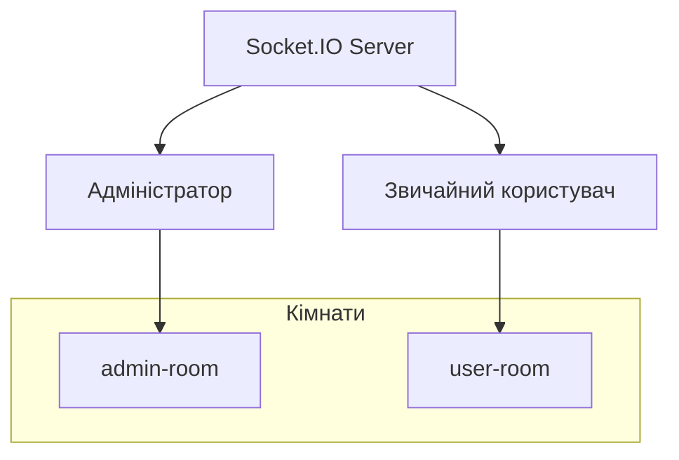

# Специфікація браузерних сповіщень через Socket.IO

## 1. Огляд функціональності
Реалізація системи браузерних сповіщень для адміністраторів та користувачів з використанням Socket.IO для отримання подій у реальному часі.

## 2. Типи сповіщень

### 2.1 Сповіщення про тікети
- **new_ticket** - новий тікет створено
- **status_change** - зміна статусу тікету

### 2.2 Сповіщення про реєстрацію
- **registration-notification** - новий запит на реєстрацію
- **registration-count-update** - оновлення кількості очікуючих реєстрацій

## 3. Архітектура Socket.IO



## 4. Реєстрація подій на фронтенді

### 4.1 Підключення до Socket.IO
```javascript
// Ініціалізація Socket.IO клієнта
const socket = io(SOCKET_URL);

// Підключення до кімнат
socket.emit('join-room', 'admin-room'); // для адмінів
socket.emit('join-room', 'user-room'); // для користувачів
```

### 4.2 Прослуховування подій
```javascript
// Сповіщення про тікети
socket.on('ticket-notification', (data) => {
  const { type, ticketId, message } = data;
  showNotification('Новий тікет', message);
});

// Сповіщення про реєстрацію
socket.on('registration-notification', (data) => {
  const { userEmail, timestamp } = data;
  showNotification('Новий запит на реєстрацію', `Користувач: ${userEmail}`);
});

// Оновлення кількості реєстрацій
socket.on('registration-count-update', (data) => {
  const { count } = data;
  updateRegistrationBadge(count);
});
```

## 5. Система браузерних сповіщень

### 5.1 Запит дозволу
```javascript
async function requestNotificationPermission() {
  if ('Notification' in window) {
    const permission = await Notification.requestPermission();
    return permission === 'granted';
  }
  return false;
}
```

### 5.2 Показ сповіщень
```javascript
function showNotification(title, body, icon = '/notification-icon.png') {
  // Спроба показати браузерне сповіщення
  if (Notification.permission === 'granted') {
    new Notification(title, {
      body,
      icon,
      badge: '/badge-icon.png',
      tag: 'helpdesk-notification',
      requireInteraction: true
    });
  }
  
  // Fallback: показати toast сповіщення в додатку
  showToastNotification(title, body);
}
```

### 5.3 Toast сповіщення (fallback)
```javascript
function showToastNotification(title, body) {
  // Створити toast елемент
  const toast = document.createElement('div');
  toast.className = 'notification-toast';
  toast.innerHTML = `
    <div class="toast-header">
      <span class="toast-title">${title}</span>
      <button class="toast-close">&times;</button>
    </div>
    <div class="toast-body">${body}</div>
  `;
  
  // Додати стилі
  toast.style.cssText = `
    position: fixed;
    top: 20px;
    right: 20px;
    background: white;
    border-radius: 8px;
    box-shadow: 0 4px 12px rgba(0,0,0,0.15);
    padding: 16px;
    min-width: 300px;
    z-index: 1000;
    animation: slideIn 0.3s ease-out;
  `;
  
  document.body.appendChild(toast);
  
  // Автоматичне приховування через 5 секунд
  setTimeout(() => {
    toast.remove();
  }, 5000);
}
```

## 6. Компоненти React

### 6.1 NotificationProvider
```javascript
// components/NotificationProvider.jsx
import { createContext, useContext, useEffect } from 'react';
import { io } from 'socket.io-client';

const NotificationContext = createContext();

export const useNotifications = () => {
  const context = useContext(NotificationContext);
  if (!context) {
    throw new Error('useNotifications must be used within NotificationProvider');
  }
  return context;
};

export const NotificationProvider = ({ children }) => {
  useEffect(() => {
    // Ініціалізація сповіщень при монтуванні
    requestNotificationPermission();
    
    // Підключення до Socket.IO
    const socket = io(import.meta.env.VITE_SOCKET_URL);
    
    // Підключення до відповідної кімнати
    const userRole = getUserRole(); // отримати роль користувача
    if (userRole === 'admin') {
      socket.emit('join-room', 'admin-room');
    }
    
    // Прослуховування подій
    setupSocketListeners(socket);
    
    return () => {
      socket.disconnect();
    };
  }, []);
  
  return (
    <NotificationContext.Provider value={{}}>
      {children}
    </NotificationContext.Provider>
  );
};
```

### 6.2 ToastNotification компонент
```javascript
// components/ToastNotification.jsx
import { useState, useEffect } from 'react';

export const ToastNotification = () => {
  const [notifications, setNotifications] = useState([]);
  
  useEffect(() => {
    // Прослуховування подій сповіщень
    const handleNotification = (event) => {
      const { title, body } = event.detail;
      const id = Date.now();
      
      setNotifications(prev => [...prev, { id, title, body }]);
      
      // Автоматичне видалення
      setTimeout(() => {
        setNotifications(prev => prev.filter(n => n.id !== id));
      }, 5000);
    };
    
    window.addEventListener('app-notification', handleNotification);
    
    return () => {
      window.removeEventListener('app-notification', handleNotification);
    };
  }, []);
  
  return (
    <div className="toast-container">
      {notifications.map(notification => (
        <div key={notification.id} className="toast">
          <div className="toast-content">
            <h4>{notification.title}</h4>
            <p>{notification.body}</p>
          </div>
          <button 
            className="toast-close"
            onClick={() => removeNotification(notification.id)}
          >
            ×
          </button>
        </div>
      ))}
    </div>
  );
};
```

## 7. Стилі CSS

```css
/* Toast контейнер */
.toast-container {
  position: fixed;
  top: 20px;
  right: 20px;
  z-index: 1000;
  display: flex;
  flex-direction: column;
  gap: 10px;
}

/* Toast елемент */
.toast {
  background: white;
  border-radius: 8px;
  box-shadow: 0 4px 12px rgba(0, 0, 0, 0.15);
  padding: 16px;
  min-width: 300px;
  display: flex;
  justify-content: space-between;
  align-items: flex-start;
  animation: slideIn 0.3s ease-out;
}

.toast-content h4 {
  margin: 0 0 8px 0;
  color: #333;
  font-size: 16px;
  font-weight: 600;
}

.toast-content p {
  margin: 0;
  color: #666;
  font-size: 14px;
}

.toast-close {
  background: none;
  border: none;
  font-size: 20px;
  color: #999;
  cursor: pointer;
  padding: 0;
  margin-left: 16px;
}

.toast-close:hover {
  color: #333;
}

/* Анімація */
@keyframes slideIn {
  from {
    transform: translateX(100%);
    opacity: 0;
  }
  to {
    transform: translateX(0);
    opacity: 1;
  }
}
```

## 8. Інтеграція з існуючим додатком

### 8.1 Оновлення main.jsx
```javascript
import { NotificationProvider } from './components/NotificationProvider';

ReactDOM.createRoot(document.getElementById('root')).render(
  <React.StrictMode>
    <NotificationProvider>
      <App />
    </NotificationProvider>
  </React.StrictMode>
);
```

### 8.2 Додавання ToastNotification в App.jsx
```javascript
import { ToastNotification } from './components/ToastNotification';

function App() {
  return (
    <div className="app">
      {/* Існуючий контент */}
      <ToastNotification />
    </div>
  );
}
```

## 9. Залежності

```json
{
  "dependencies": {
    "socket.io-client": "^4.7.2"
  }
}
```

## 10. Тестування

### 10.1 Тестові події
```javascript
// Для тестування можна емітити події вручну
socket.emit('test-notification', {
  type: 'new_ticket',
  ticketId: '123',
  message: 'Тестове сповіщення'
});
```

### 10.2 Перевірка дозволів
```javascript
console.log('Notification permission:', Notification.permission);
```